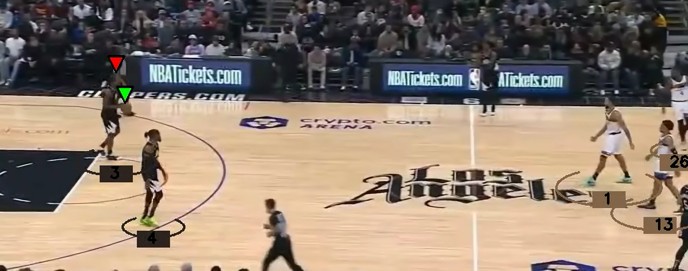

# YOLOv11 Ball & Player Detection & Tracking

## Overview
This project utilizes **YOLOv11** to detect and track players and a ball separately in sports footage. The system assigns unique IDs to players and tracks them throughout the game. Additionally, different teams are highlighted with distinct colors using the **K-Means clustering algorithm** from **Scikit-learn**, based on their jersey colors.

## Features
- **Ball & Player Tracking**: Detects and tracks the ball and players using YOLOv11.
- **Team Identification**: Differentiates teams using K-Means clustering on jersey colors.
- **Visual Enhancements**: Ball tracked with a **green arrow**, ball-holder with a **red arrow**, and team members highlighted with **ellipses**.
- **Real-Time Performance**: Optimized for smooth tracking and processing.

## Model Training
- Two separate models are used: one for detecting players and another for detecting the ball.
- Both models were fine-tuned using **YOLOv11x** on separate datasets sourced from **Roboflow**.
- The training was conducted on **Google Colab** utilizing its **GPU** for accelerated performance.

## Example Output

